<h1 style="text-align: center"> Facial Landmark Detection</h1>

Nguyen Truong Phat

March 2020

# 1. Introduction

In this project we will tackle the facial landmark detection problem, for each given image we want to estimate 68 facial landmarks if human face is presented.

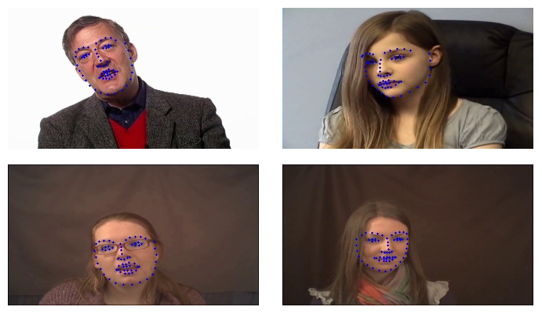

To work with this problem, we follow the optimizing method proposed in [1].  The paper introduced a method called Supervised Descent Method (SDM) to minimize a non-linear least squares (NLS) function. SDM aims to minimize the NLS function by minimizing the sequence of gradient directions.

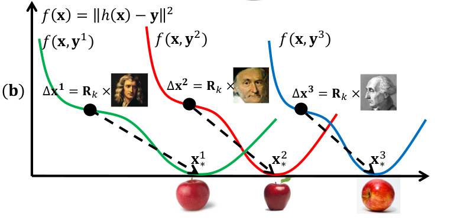

# 2. Proposed pipeline

Our pipeline for this problem consists of 4 stages as follow:

- **Data preparation and Feature extraction:** Prepare data for training and evaluation.
- **Training:**  train a SDM model using prepared dataset.
- **Evaluation:** Measure detection performance using metrics.
- **Deployment:** Deploy the system as a Web Application.

## 2.1 Data preparation and feature extraction

For each video we sampling images for every 15 frames. Therefore, we have 14511 samples of training data

For each images of arbitrary size, we resize it to 180x320 (HxW), and its landmark labels accordingly. Then we extract feature from the image using HOG descriptor, end up having a vector of 6080 dimensions.

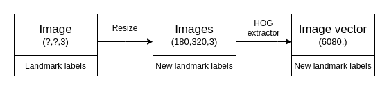

## 2.2. Training

We use the architecture proposed in [1] as cascaded regression model. The following pipeline is as following:

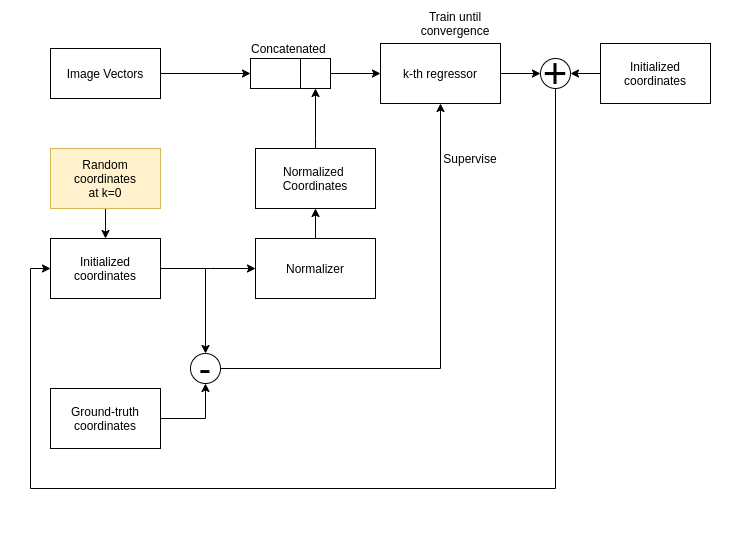

## 2.3. Evaluation

For evaluation, we use mean absolute error, measuring distance between predicted coordinates and ground-truth coordinates.

$$
\text{MAE} = \frac{1}{N}\sum |y-\hat{y}|
$$

Every k-th regressor improves the converges MAE loss of the previous one. In conclusion, fusing numerous regressors can result in a more powerful one.

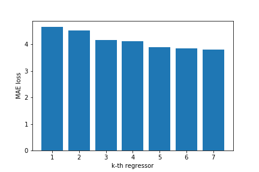

# 3. Deployment

The application is deployed at [here]( http://www.fld.patrickphat.com/)

You can download the processed data to test at [here](https://drive.google.com/drive/folders/1H9ITdtWWfZ2yZhpwkV2VLYMQ3VQe6Tg_?usp=sharing)

# 4. Implementation

You can access the experimental notebooks at `/Experimental-Notebooks/`. Experimental notebooks can be messy.

All modules can be found at `/helper/`

Also, web application source code is located at `/landmark-face-detection-app/`

Due to shortage of time, I didn't make it to write decent instructions and comments for all modules.

# 5. Example results

The result is not perfect but decently good.
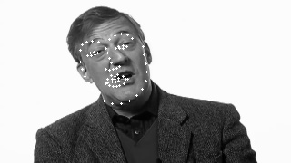
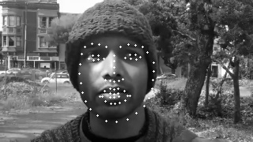
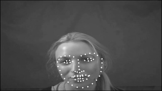
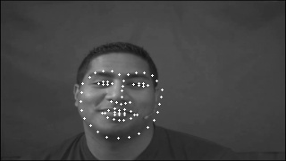
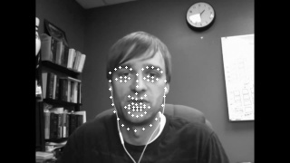
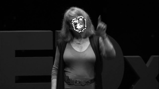

# 6. References 

[1] Xuehan Xiong, Fernando De la Torre - Supervised Descent Method and its Applications to Face Alignment.